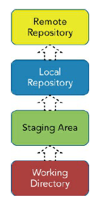
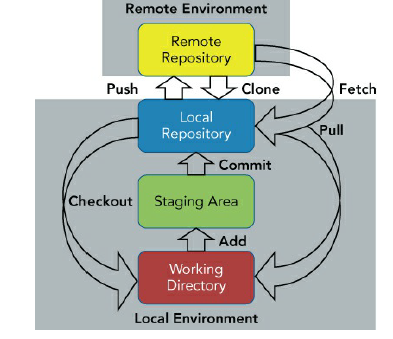
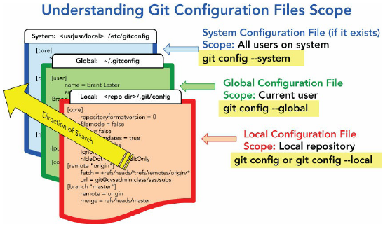

# Introduction to git
Here the level of git  
  
A ```working directory``` can have any number of subdirectories that form an overall workspace. (You might
also hear this referred to by similar names such as “working tree” or  “worktree.”)  
The ```staging area``` is one of the concepts in Git that many new users
have difficulty understanding and appreciating. At first glance, it may
seem like an unnecessary intermediate level that gets in the way of
trying to promote content from the working directory to the local
repository. In fact, it plays a significant role in several parts of Git's
functionality.  
There are 2 scenarios that originate with the user moving files into the stating area.  
The first is ```Prepare scenario```, suppose you have a large checklist of files to modify in order 
to create a feature or fix a bug. As pieces of the larger change are done, you move those pieces to the
staging area and check them off your list.
The second use case is the ```Repair scenario```. One of the interesting things that
Git allows users to do is to rewrite history.Effectively, it provides a do-over, or an opportunity to repair the
last commit.  
The workflow is essentially as follows:
* Make any updates in the working directory.
* Put the updates into the staging area.
* Run the commit with the option to amend.  

The ```local repository``` is the final piece of the set of Git levels that exist
on a user's local machine (the local environment). Once content has
been created or updated and then staged, it is ready to be committed
into the local repository.  
The ```remote repository``` is the level of Git that hosts and serves up
content for wider consumption. It's the place where multiple Git users
sync up the changes from their respective local repositories. It
corresponds to what you would traditionally think of as the server in
other source management systems.
  

## Set the environment auto-completion and prompt
After getting the raw version of the file, you can download that page as
the file git-completion.bash to your local system. Once the script is
downloaded, you add a line like the following into your .bashrc file
(create the file if needed):
```shell
cd 
wget https://raw.githubusercontent.com/git/git/master/contrib/completion/git-completion.bash
mv git-completion.bash ~/.git-completion.bash
wget  https://raw.githubusercontent.com/git/git/master/contrib/completion/git-prompt.sh
chmod +x git-prompt.sh 
./git-prompt.sh
vi ~/.bashrc
#add this line
if [ -f ~/.git-completion.bash ]; then
  . ~/.git-completion.bash
fi
## Add at the end of file
PS1='[\u@\h \W$(__git_ps1 " (%s)")]\$ '
```

## git config -- Telling git who you are
The first two pieces
are simply issuing the config command from git. After that is an
option, global, (preceded by two hyphens because you are spelling it
out).  
There are 3 levels of configuration: system, global and local:  
```System``` is st at machine level   
``Global`` applies to all repositories for a particular user, unless overridden
at the local level.  
```Local``` sets the configuration value at the local level means that the setting 
only applies in the context of one repository.



```shell
git config --global user.name "your name"
git config --global user.mail "email address"
```
To undo an option  
```shell
git config --unset --global user.name
```
List
```shell
git config --list
# set the default editor
git config --global core.editor vim  # for example
git config --global core.editor nano
# End of line settings
git config --global core.autocrlf=true # for Windows user
git config --global core.autocrlf=input # for Linux user
# Alias 
git log --color --graph --pretty=format:'%Cred%h%Creset -%C(yellow)%d%Creset %s %Cgreen(%cr) %C(bold blue)<%an>%Creset' --abbrev-commit"
git config --global alias.lg "log --color --graph --pretty=format:'%Cred%h%Creset -%C(yellow)%d%Creset %s %Cgreen(%cr) %C(bold blue)<%an>%Creset' --abbrev-commit"
```
